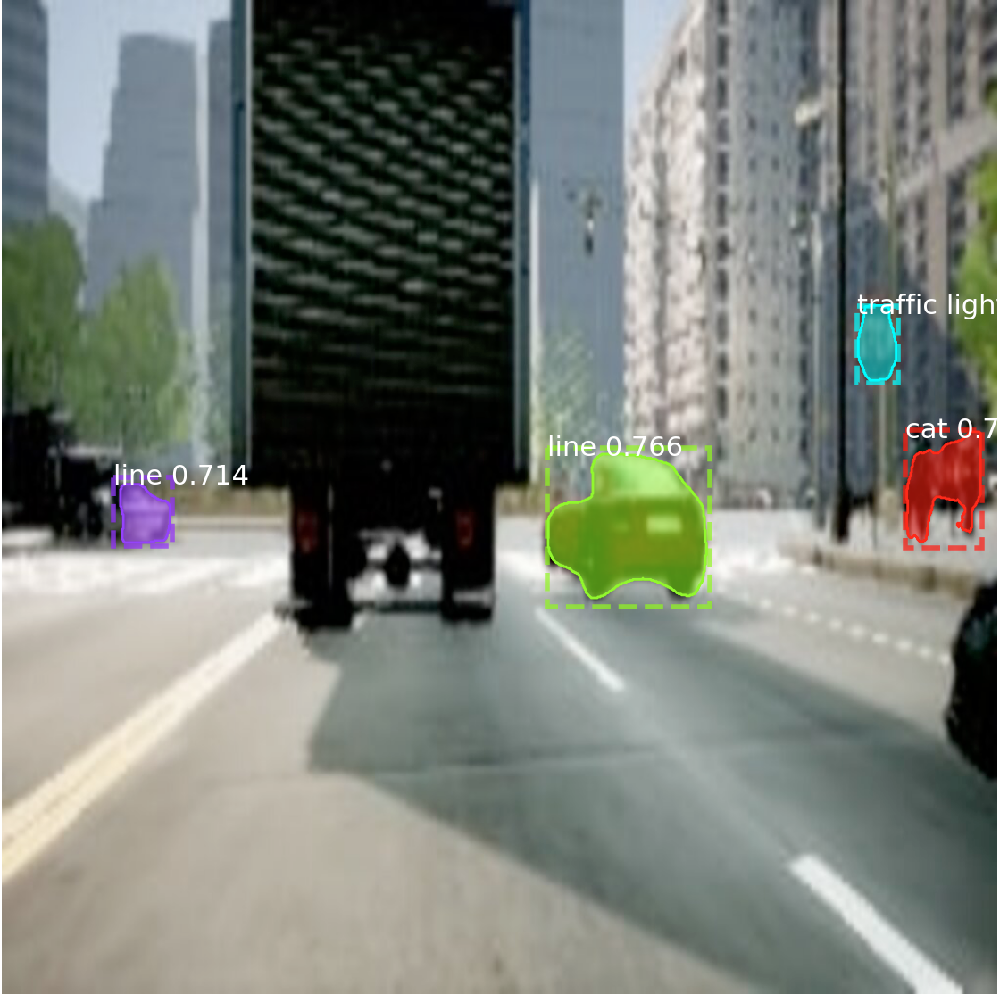
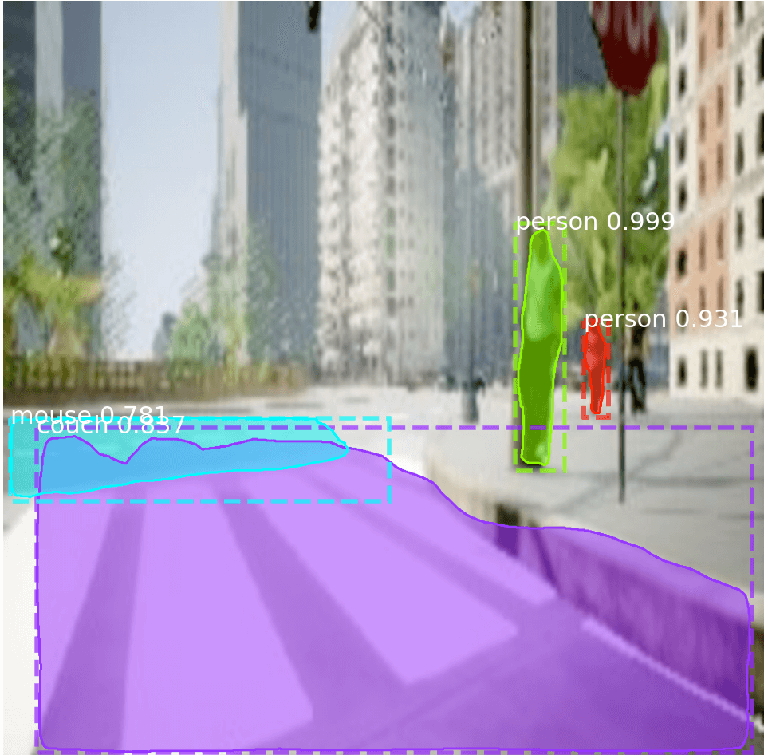
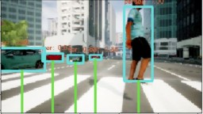
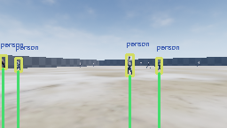

# Computer Vision

Computer Vision is an important part of the autonomous driving pipeline. By employing vision methods, our agent is able to detect and classify objects around it such as pedestrians, buildings and other vehicles.

## Mask R-CNN
Mask R-CNN is an instance segmentation technique, which locates each pixel of an object instead of a bounding box.  It classifies the image to the class it belongs to and makes dense predictions inferring labels for each pixel in the classified object of the image for the whole input. It provides not only the classes but the spatial location of the classes that are predicted. 

## YOLO v3
YOLO is a technique which can be used to detect and classify objects with high speed and accuracy in a single pass. It does this by dividing the image into multiple regions, predicting bounding boxes for objects in the image, and using weighted probabilities to classify the objects. For the purposes of our project, we decided to use YOLO v3 over Mask R-CNN due to its high speed and accuracy.

Based on YOLO, we designed a closeness metric which takes into account the size of the object along with the length of the perpendicular drawn from the object to the bottom of the image. This allows the car to prioritize avoiding collision with objects closest to it.

